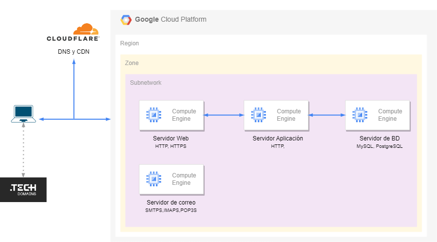

# Project 01 - Computer Networks (RC)

This project involves the implementation and configuration of a distributed infrastructure using **Google Cloud Platform (GCP)**, integrating multiple instances and services, along with security tools and email management.

---

## Table of Contents

- [Infrastructure Diagram](#infrastructure-diagram)
- [GCP Services and Configuration](#gcp-services-and-configuration)
- [Configuration Procedures](#configuration-procedures)
  - [VPC and Firewall Rules](#vpc-and-firewall-rules)
  - [Instances and Their Roles](#instances-and-their-roles)
  - [Web Server and Redirection Setup](#web-server-and-redirection-setup)
  - [Apache and HTTP/2 Implementation](#apache-and-http2-implementation)
  - [Database Configuration and Security](#database-configuration-and-security)
  - [Email Server Configuration](#email-server-configuration)
- [Conclusions](#conclusions)
- [Connect with Me on LinkedIn](#connect-with-me-on-linkedin)

---

## Infrastructure Diagram

The project includes a general network diagram that outlines the architecture of the deployed infrastructure.

This diagram identifies the following elements and connections:

- **VPC**: Creation and configuration of the Virtual Private Cloud.
- **Firewall Rules**: Custom rules that allow HTTP/HTTPS traffic over IPv4 and IPv6, SSH access, and specific traffic restrictions between instances (e.g., only allowing the *web-server* to access port 80 on the *app-server*).
- **Instances**:
  - **Web-Server**: Handles incoming traffic and redirects to the *app-server*.
  - **App-Server**: Hosts the application logic and connects to the database.
  - **Data-Server**: Runs the PostgreSQL database.
  - **Email-Server**: Manages email services via Mail-in-a-Box.

---

## GCP Services and Configuration

The infrastructure was deployed on GCP using several services and configurations:
- **Google Compute Engine**: For creating virtual machine instances (VMs) for web, app, data, and email servers.
- **Google Cloud VPC**: For defining a private network interconnecting the instances securely.
- **Firewall Rules**: To control and secure inbound and outbound traffic.
- **Cloud DNS and Cloudflare**: To manage DNS records and improve performance using page rules and SSL/TLS certificate settings.

---

## Configuration Procedures

### VPC and Firewall Rules

- **VPC:** A private network was created as the core of the infrastructure.
- **Firewall Rules:**
  - Allow HTTP/HTTPS traffic for both IPv4 and IPv6.
  - Allow SSH connections to all instances.
  - Allow the *app-server* to receive connections throughout port 80 only from *web-server*.
  - Additional but necessary rules for email and database services.

### Instances and Their Roles

Each instance plays a specific role in the VPC system:
- **Web-Server:** Installs and configures Apache2, sets up redirection to the app server, handles HTTPS via Certbot and HTTP/2 support was enabled.
- **App-Server:** Hosts the backend application and securely connects to the database, also encrypts user password. External IP was removed.
- **Data-Server:** Runs PostgreSQL with secured access configurations and encrypted communication. External IP was also removed.
- **Email-Server:** Configures Mail-in-a-Box (includes fail2ban) with proper DNS settings for full email functionality.

### Web Server and Redirection Setup

- Installed **Apache2**, enabled required modules, and set up custom configuration files (`redes.conf` and `final.conf`) to manage redirection.
- Configured Cloudflare DNS records.
- Enabled **HTTPS** using Certbot.
- Set **fail2ban** configuration

### Apache and HTTP/2 Implementation

- Apache was configured to support the **HTTP/2** protocol, enhancing performance and reducing latency.
- Domain access was tested to ensure redirection and HTTPS functionality worked as expected.

### Database Configuration and Security

- **PostgreSQL** was installed and configured to listen data server IP.
  - User and database creation.
  - Encrypted communication (AES 256-bit) between *app-server* and *data-server*.
  - Passwords are securely hashed before being stored.
- **Security Measures:**
  - Installed and configured **fail2ban** across servers to block unauthorized SSH attempts.

### Email Server Configuration

- **Mail-in-a-Box** was installed for complete email service management (includes **fail2ban** and more open source software).
- Proper DNS records (A, AAAA, MX, TXT) were added to **Cloudflare** for SPF, DKIM, and DMARC.
- Reverse DNS (PTR) records were configured.
- Webmail access was verified and email was tested using external gmail/hotmail/outlook accounts and the **Thunderbird** mail client.

---

## Conclusions

This project demonstrates the successful deployment of a networked infrastructure using GCP services, with clearly defined instance roles and advanced security measures. The configuration of web, app, and database servers, along with email integration using Mail-in-a-Box, provides a solid example of secure and functional infrastructure design for educational and real-world applications.

---

## Connect with Me on LinkedIn

Want to learn more about this project or connect professionally? You can get in touch with me on [LinkedIn](https://www.linkedin.com/in/jorge-luis-escorza-s%C3%A1nchez-9ab935325/);
